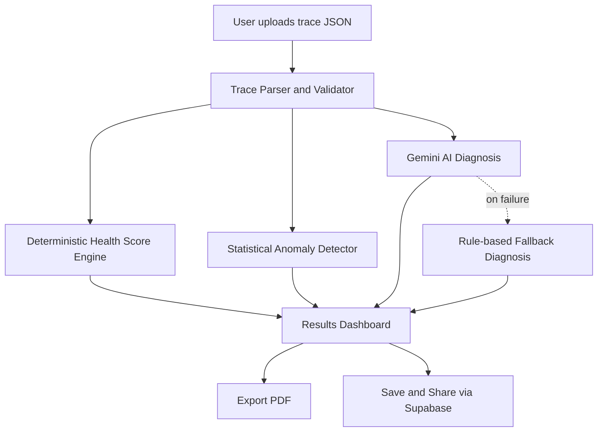

# 🩺 AgentAutopsy

**AI-powered forensic diagnosis for failing AI agents.**


Upload an AI agent's execution trace and get an instant, AI-generated diagnosis: what went wrong, how confident the diagnosis is, and a concrete fix — in seconds.

🔗 **Live app:** [agentautopsy-blond.vercel.app](https://agentautopsy-blond.vercel.app)
📂 **Repository:** [github.com/ailanasirai/agentautopsy](https://github.com/ailanasirai/agentautopsy)

---

## Table of Contents

- [The Problem](#the-problem)
- [The Solution](#the-solution)
- [Features](#features)
- [The AI Feature](#the-ai-feature)
- [Tools, Services & Models](#tools-services--models-used)
- [Architecture](#architecture)
- [Project Structure](#project-structure)
- [Screenshots](#screenshots)
- [How to Run Locally](#how-to-run-locally)
- [Environment Variables](#environment-variables)
- [Known Limitations](#known-limitations)
- [Future Roadmap](#future-roadmap)
- [Grading Criteria Mapping](#grading-criteria-mapping)
- [License](#license)

---

## The Problem

In 2026, nearly every team building AI products ships **AI agents** — LangChain pipelines, n8n automations, CrewAI crews, or fully custom agent loops. But when an agent fails — it gets stuck in a loop, calls the wrong tool, hallucinates a fact, or times out — developers are left manually reading raw JSON logs to figure out **why**.

Existing observability tools (LangSmith, Datadog, generic logging dashboards) show you **what happened**, step by step, but none of them tell you **why it happened** in plain language, or **how to fix it**. That gap — between raw logs and an actual diagnosis — is what this project addresses.

**Who this is for:** AI/ML developers shipping agentic workflows, students building agent-based final projects, and anyone debugging LangChain/n8n/custom agent pipelines who doesn't want to manually trace through JSON logs.

## The Solution

**AgentAutopsy** takes an agent's execution trace (a JSON log of every step it took) and runs it through a diagnostic pipeline: a deterministic health-scoring engine, a statistical anomaly detector, and an AI diagnosis engine (Gemini 2.0 Flash) that explains — in plain English — what went wrong and how to fix it, complete with an honest confidence score.

---

## Features

- **Trace upload** — drag & drop, click-to-browse, or clipboard paste (Ctrl+V) of a JSON trace
- **4 built-in sample traces** — Infinite loop, Wrong tool call, Hallucination, Healthy run (instant testing without your own file)
- **AI-powered root cause diagnosis** — Gemini parses the trace and generates the failure type, root cause, and fix
- **Confidence scoring** — every diagnosis carries an honest confidence percentage, never fake certainty
- **Deterministic health score** — a 0–100 score computed by rules, not AI, so it's reproducible
- **Anomaly heatmap** — visualizes how unusual each step is relative to the rest of the run
- **Explainable AI reasoning** — the model's reasoning chain is visible, never a black box
- **Resilient fallback engine** — if the Gemini API ever fails, the app never crashes; a rule-based fallback takes over
- **Exportable PDF reports**
- **Shareable public report links** (Supabase-backed)
- **Dark/light mode**, fully responsive, animated UI

---

## The AI Feature

**Model:** Gemini 2.0 Flash (`@google/generative-ai`)

When a trace is uploaded, the backend calls Gemini with a structured prompt containing the full trace (every step, tool call, and status), instructing it to return a **strict JSON diagnosis**.

**Exact prompt template used** (`lib/promptTemplates.ts`):

```
You are an expert AI agent debugging assistant. Analyze this agent execution trace and diagnose what went wrong (if anything).

AGENT: {agent_name} (framework: {framework})
EXPECTED OUTCOME: {expected_outcome}
FINAL OUTPUT: {final_output}

EXECUTION STEPS:
{each step: number, type, tool_name, status, input, output}

Classify the failure (if any) into exactly one of: "loop", "wrong_tool_call", "hallucination", "timeout", "none".

Respond with ONLY valid JSON, no markdown fences, no preamble, in this exact shape:
{
  "failure_detected": boolean,
  "failure_type": "loop" | "wrong_tool_call" | "hallucination" | "timeout" | "none",
  "root_cause": "one clear sentence explaining what went wrong and at which step",
  "suggested_fix": "one clear, actionable sentence on how to fix it",
  "confidence": number (0-100, your genuine confidence in this diagnosis),
  "reasoning_chain": ["short reasoning step 1", "short reasoning step 2", "short reasoning step 3"]
}
```

If the Gemini call fails for any reason (invalid key, quota, network issue), a **rule-based fallback engine** (`lib/gemini.ts`) analyzes the same trace using deterministic heuristics — retry counts, error step types, decision-step failures — so the app always returns a usable diagnosis instead of crashing.

---

## Tools, Services & Models Used

| Category | Choice |
|---|---|
| Framework | Next.js 15 (App Router, TypeScript) |
| Styling | Tailwind CSS |
| Animation | Framer Motion |
| AI Model | Google Gemini 2.0 Flash |
| Database | Supabase (Postgres) — shareable reports |
| PDF Export | jsPDF |
| Icons | Lucide React |
| Hosting | Vercel |
| Version Control | Git + GitHub |

---

## Architecture



**Key design decision:** the Health Score is calculated deterministically (not by AI) so scores stay consistent and reproducible — the AI is only responsible for the *explanation*, not the number.

---

## Project Structure

```
agentautopsy/
├── app/
│   ├── page.tsx              # Landing page + upload flow
│   ├── layout.tsx            # Root layout, theme, navbar, footer
│   ├── report/[id]/          # Shareable public report view
│   └── api/
│       ├── analyze/          # Main analysis endpoint
│       └── share/            # Save/fetch shared reports
├── components/
│   ├── upload/                # Upload zone, demo trace selector
│   ├── analysis/               # Health score, root cause, timeline, heatmap, reasoning
│   ├── landing/                 # How it works, key features
│   └── layout/                   # Navbar, footer, theme provider
├── lib/
│   ├── gemini.ts               # Gemini API wrapper + fallback engine
│   ├── healthScore.ts          # Deterministic scoring logic
│   ├── anomalyDetector.ts      # Statistical anomaly calculation
│   ├── promptTemplates.ts      # AI prompt construction
│   └── sampleTraces/           # 4 built-in demo traces
└── types/trace.ts              # Shared TypeScript contracts
```

---

## Screenshots

### Landing Page


### Diagnosis Results


### Root Cause Detail


---

## How to Run Locally

```bash
git clone https://github.com/ailanasirai/agentautopsy.git
cd agentautopsy
npm install
```

Create a `.env.local` file (see `.env.example`):

```
GEMINI_API_KEY=your_gemini_api_key
NEXT_PUBLIC_SUPABASE_URL=your_supabase_project_url
NEXT_PUBLIC_SUPABASE_ANON_KEY=your_supabase_anon_key
```

```bash
npm run dev
```

Open `http://localhost:3000`.

## Environment Variables

| Variable | Purpose |
|---|---|
| `GEMINI_API_KEY` | Google Gemini API key ([get one here](https://aistudio.google.com/apikey)) |
| `NEXT_PUBLIC_SUPABASE_URL` | Supabase project URL |
| `NEXT_PUBLIC_SUPABASE_ANON_KEY` | Supabase publishable/anon key |

---

## Known Limitations

- Trace format is currently a single generic JSON schema (not native LangChain/CrewAI trace format — those would need a conversion step)
- No user accounts; shared reports are public-by-link, not access-controlled
- Confidence scores come from the AI's self-reported estimate, not a separately validated metric

## Future Roadmap

- Browser extension to capture live LangChain/n8n traces directly
- GitHub Action for automated agent regression testing on every deploy
- Native adapters for LangGraph, CrewAI, AutoGen trace formats
- Public API / SDK (`pip install agentautopsy`)
- Community benchmark leaderboard for agent reliability scores

---

## Grading Criteria Mapping

| Criteria | Where it's addressed |
|---|---|
| **Idea / originality** | See [The Problem](#the-problem) and [The Solution](#the-solution) |
| **Completion** | See [Features](#features) — every listed feature is fully functional end-to-end |
| **Deployment** | Live at [agentautopsy-blond.vercel.app](https://agentautopsy-blond.vercel.app) |
| **Reporting** | This document — features, AI prompt, architecture, screenshots, setup instructions |

---

## License

MIT
