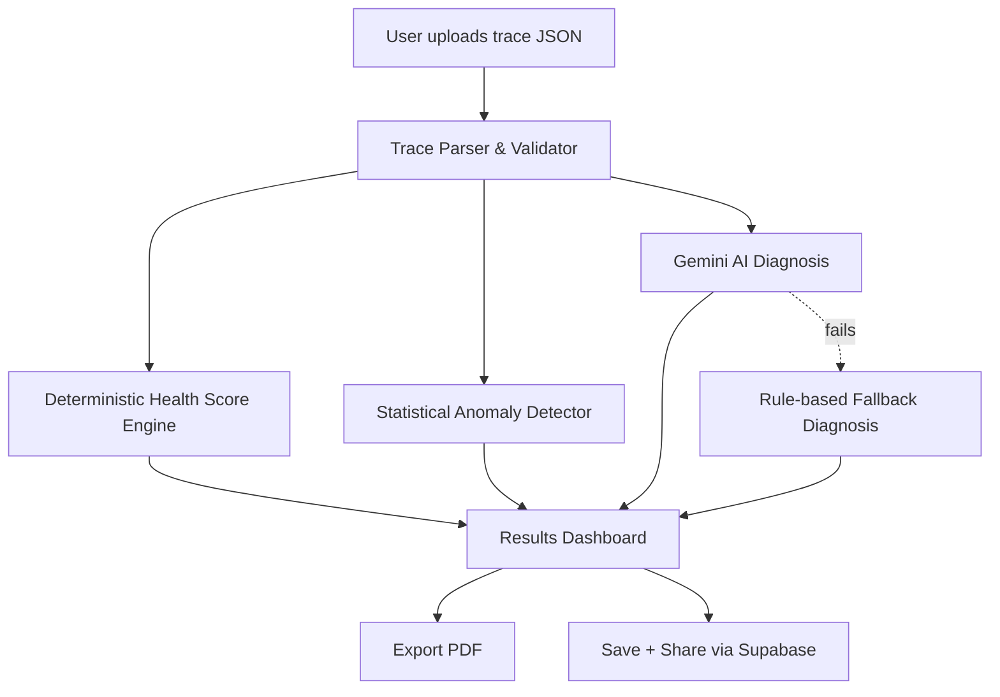
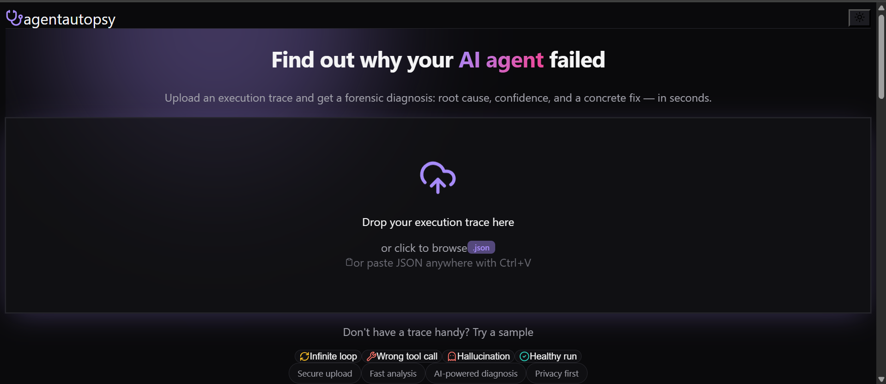
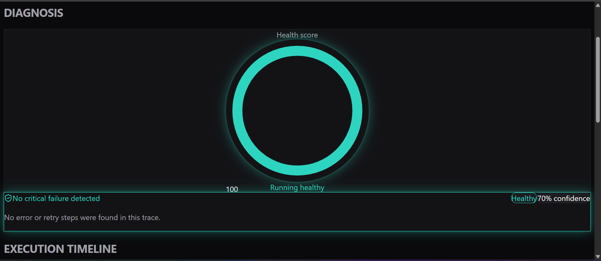
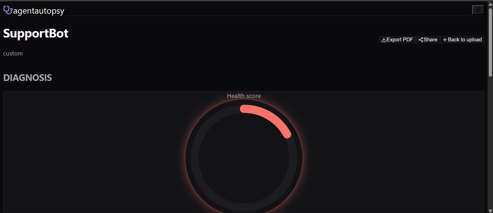

# 🩺 AgentAutopsy

**AI-powered forensic diagnosis for failing AI agents.**

Upload an AI agent's execution trace and get an instant, AI-generated diagnosis: what went wrong, how confident the diagnosis is, and a concrete fix — in seconds.

🔗 **Live app:** [agentautopsy-blond.vercel.app](https://agentautopsy-blond.vercel.app)
📂 **Repository:** [github.com/ailanasirai/agentautopsy](https://github.com/ailanasirai/agentautopsy)

---

## The Problem

2026 mein har team AI agents ship kar rahi hai (LangChain, n8n, CrewAI, custom pipelines), lekin jab ek agent fail hota hai — kisi loop mein phas jata hai, galat tool call karta hai, ya hallucinate karta hai — developers ko raw logs manually padhne padte hain taake pata chale **kyun** fail hua. Observability tools (LangSmith, Datadog) sirf traces dikhate hain; koi bhi tool **plain-language diagnosis + fix** nahi deta.

**AgentAutopsy** yeh gap fill karta hai: trace upload karo, AI khud bataye root cause aur fix.

**Kiske liye:** AI/ML developers, agentic-workflow builders, aur students jo apne agents debug kar rahe hain.

---

## Features

- **Trace upload** — drag & drop, click-to-browse, ya clipboard paste (Ctrl+V) se JSON trace daalo
- **4 built-in sample traces** — Infinite loop, Wrong tool call, Hallucination, Healthy run (bina apni file ke turant test karne ke liye)
- **AI-powered root cause diagnosis** — Gemini API trace parse kar ke failure type, root cause, aur fix generate karta hai
- **Confidence scoring** — har diagnosis apna honest confidence % dikhata hai (fake certainty nahi)
- **Deterministic health score** — 0-100 score, rule-based (AI se nahi) taake reproducible ho
- **Anomaly heatmap** — statistical deviation ke hisaab se har step ka "unusualness" visualize karta hai
- **Explainable AI reasoning** — AI ka step-by-step reasoning chain expand kar ke dekha ja sakta hai
- **Resilient fallback** — agar Gemini API kabhi fail ho, app crash nahi hota; ek rule-based fallback diagnosis deta hai
- **Exportable PDF reports**
- **Shareable public report links** (Supabase-backed)
- **Dark/light mode**, fully responsive, animated UI

---

## The AI Feature

**Model:** Gemini 2.0 Flash (`@google/generative-ai`)

Jab trace upload hoti hai, backend structured system prompt ke sath Gemini ko call karta hai, jisme poora trace (steps, tool calls, statuses) included hota hai, aur AI ko **strict JSON format** mein diagnosis return karne ko kaha jata hai.

**Exact prompt template used** (`lib/promptTemplates.ts`):

```
You are an expert AI agent debugging assistant. Analyze this agent execution trace and diagnose what went wrong (if anything).

AGENT: {agent_name} (framework: {framework})
EXPECTED OUTCOME: {expected_outcome}
FINAL OUTPUT: {final_output}

EXECUTION STEPS:
{each step: number, type, tool_name, status, input, output}

Classify the failure (if any) into exactly one of: "loop", "wrong_tool_call", "hallucination", "timeout", "none".

Respond with ONLY valid JSON, no markdown fences, no preamble, in this exact shape:
{
  "failure_detected": boolean,
  "failure_type": "loop" | "wrong_tool_call" | "hallucination" | "timeout" | "none",
  "root_cause": "one clear sentence explaining what went wrong and at which step",
  "suggested_fix": "one clear, actionable sentence on how to fix it",
  "confidence": number (0-100, your genuine confidence in this diagnosis),
  "reasoning_chain": ["short reasoning step 1", "short reasoning step 2", "short reasoning step 3"]
}
```

If the Gemini call fails for any reason (invalid key, quota, network), a **rule-based fallback engine** (`lib/gemini.ts`) analyzes the same trace using deterministic heuristics (retry counts, error step types) so the app always returns a usable diagnosis instead of crashing.

---

## Tools, Services & Models Used

| Category | Choice |
|---|---|
| Framework | Next.js 15 (App Router, TypeScript) |
| Styling | Tailwind CSS |
| Animation | Framer Motion |
| AI Model | Google Gemini 2.0 Flash |
| Database | Supabase (Postgres) — shareable reports |
| PDF Export | jsPDF |
| Icons | Lucide React |
| Hosting | Vercel |
| Version Control | Git + GitHub |

---

## Architecture



**Key design decision:** the Health Score is calculated deterministically (not by AI) so scores are consistent and reproducible — the AI is only responsible for the *explanation*, not the number.

---

## Screenshots

| Landing Page | Diagnosis Results | Root Cause Detail |
|---|---|---|
|  |  |  |

---

## How to Run Locally

```bash
git clone https://github.com/ailanasirai/agentautopsy.git
cd agentautopsy
npm install
```

Create a `.env.local` file (see `.env.example`):

```
GEMINI_API_KEY=your_gemini_api_key
NEXT_PUBLIC_SUPABASE_URL=your_supabase_project_url
NEXT_PUBLIC_SUPABASE_ANON_KEY=your_supabase_anon_key
```

```bash
npm run dev
```

Open `http://localhost:3000`.

---

## Future Roadmap

- Browser extension to capture live LangChain/n8n traces directly
- GitHub Action for automated agent regression testing on every deploy
- Native adapters for LangGraph, CrewAI, AutoGen trace formats
- Public API / SDK (`pip install agentautopsy`)
- Community benchmark leaderboard for agent reliability scores

---

## License

MIT
